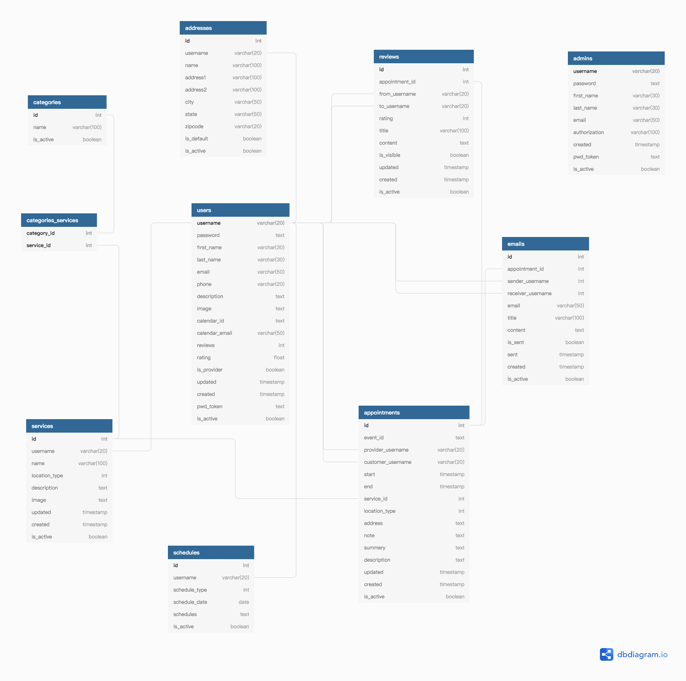

#  **Book your services**

Estimated Hours: 40 Hours

## 1. What goal will your website be designed to achieve?

- Customer can find service provider on the website and make appointment with them. 

- Service providers can define the appointment slots and see all appointment information throught the dashboard and a shared google calendar with any device.

- Customer can book the appointment from the provider list or get a link directly from the website of providers or other resources.
  
- Email notification with any update of the appointment to both customers and providers

## 2. What kind of users will visit your site? In other words, what is the demographic of your users?

Customer looking for services. 

Individual and small company providing services and looking for a easy to use online appointment system. 

## 3. What data do you plan on using? You may have not picked your actual API yet,which is fine, just outline what kind of data you would like it to contain.
   
I am going to store all the customer and service provider information in database. Using google calendar API to make a shared calendar for each service provider and sync all appointment information to it.
Current planning to use these parts of the google calendar api:
- Acl Access control. Control how to share the calendar with the providers
- Calendars Create, update calendar for the providers
- Events Create, update, delete appointment for the providers

## 4. In brief, outline your approach to creating your project (knowing that you may not know everything in advance and that these details might change later). Answer questions like the ones below, but feel free to add more information:

### a. What does your database schema look like?

### b. What kinds of issues might you run into with your API?
- Networking problem if the syncing with google calendar failed. How to handle it. And when appointment change or cancel, how to handle it.

- Keep the appointment saved in the database first and then figure out how to redo the sync again.
- Another issue could be creating a new calendar for each provider. If the user growing quick it may run into limit of the google calendar service. But it shouldn't be an issue with it for right now. [Avoid Calendar use limits](https://support.google.com/a/answer/2905486?hl=en#:~:text=Create%20too%20many%20events,limit%20type%20is%20fully%20replenished.)

### c. Is there any sensitive information you need to secure?
- User password, address and emails.

### d. What functionality will your app include?
- List of services and providers.
- Providers can set up there schedule to receive appointments.
- Customer can make appointment.
- Appointment information automatic sync to google calendar and see it on the phone
- email confirmed automatic send to provider and customer. emails can also be viewed on the website.
- Customer review system and will be list on the provider profile page.
### e. What will the user flow look like?
- Providers set up services information and schedules
- Customer search for service providers
- Make appointment with providers
- Appointment saved into database.
- Appointment saved into google calendar.
- Appointment information got send to provider and customer by email.
- (Customer got service)
- Customer review the provider

### f. What features make your site more than CRUD? Do you have any stretch goals?
The feature making this site different is appointment information saving into google calendar and shared with the providers

Stretch goals:

- Expanding the support from just google calendar to outlook calendar and more other popular calendar system. Making the system more flexable and the users have more choices.
  
- Support multiple google accounts, giving it more flexible provider can use there own account or a shared calendar.

- Using blueprints to seperate different part of the app. Making it for flexible and managable