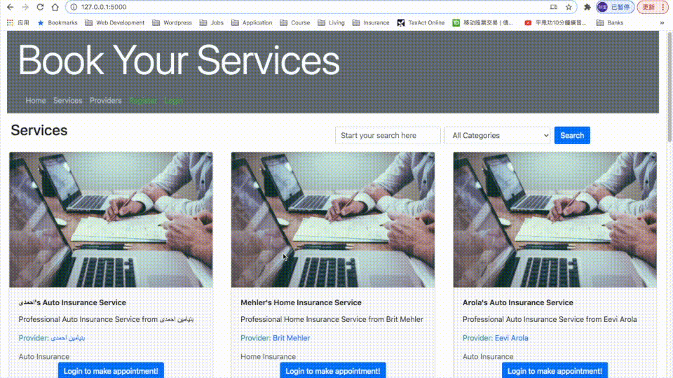
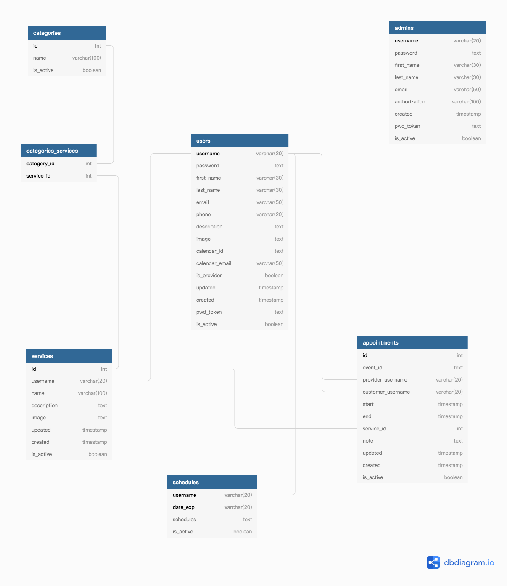

# Book Your Services

## Testing URL:
- Try the frontpage here: [Book Your Services](https://book-your-services.herokuapp.com/)

- Try the Administration Panel here: [Administration Panel](https://book-your-services.herokuapp.com/admin)

## About
- A platform let providers post their services and manage their appointments online. 

- All providers with a Gmail account would get a dedicated shared google calendar containing all appointment information and updates as well as they can manage all their information on the website. All appointment updates would be sent by the email also.

- All customers can easily search all services they need and make appointment with provider. All appointments can be managed on the website. They would be email notification with all updates of the appointments.

## User Flows
- Registration

- Create services
 

- Set up schedules

- Making appointments

## Stack
- [Python](https://www.python.org/)
- [Flask](https://flask.palletsprojects.com/en/1.1.x/)
- [Blueprints](https://flask.palletsprojects.com/en/1.1.x/blueprints/)
- [PostgreSQL](https://www.postgresql.org/)
- [SQLAlchemy](https://www.sqlalchemy.org/)
- [WTForms](https://wtforms.readthedocs.io/en/2.3.x/)
- [Flask Mail](https://github.com/mattupstate/flask-mail)
- [Google Calendar](https://developers.google.com/calendar)
- [HTML5](https://developer.mozilla.org/en-US/docs/Web/Guide/HTML/HTML5)
- [Javascript](https://developer.mozilla.org/en-US/docs/Web/JavaScript)
- [jQuery](https://jquery.com/)
- [axios](https://github.com/axios/axios)
- [CSS 3](https://developer.mozilla.org/en-US/docs/Web/CSS)
- [Bootstrap](https://getbootstrap.com/)
- [Font Awesome](https://fontawesome.com/start)
- [Amazon S3](https://aws.amazon.com/s3/?c=s&sec=srv)

## Features

- ### Shared Google Calendar
All providers with a Gmail account can get a dedicated shared Google Calendar showing all up to date appointment information. As Google Calendar is so popular and almost can be viewed and get reminder on all cellphone today, providers would easily get appointment remind from the phone and don't have to go the the website and check them out.

Future planning: Adding outlook calendar support into the system, this would make it more convinient for people not using Gmail.

- ### Email Notification
Email all the appointment updates (including new appointment, changes and cancelations) can keep the appointment record as you go. 

- ### Amazon S3 Storage
The Heroku filesystem is ephemeral - that means that any changes to the filesystem whilst the dyno is running only last until that dyno is shut down or restarted. I have to make a way to keep the uploaded images alive. S3 is the choice.

- ### Customizable Schedule Setting
Schedules can be setup for weekly and specific days. 

## API

### Google Calendar API
[Google Calendar API](https://developers.google.com/calendar/overview)

### Amazon S3 API
[Amazon S3](https://boto3.amazonaws.com/v1/documentation/api/latest/index.html)

## Data schema

